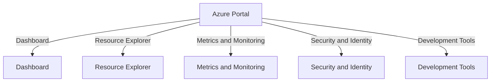

# Exploring the Azure Portal 🚀

Welcome to the Azure Portal section of the Azure Data Fundamentals Guide! 🌟 In this section, we will walk you through the key features and components of the Azure Portal, the central management interface for Azure services.

## Introduction to the Azure Portal

The Azure Portal is a web-based interface that provides a unified and intuitive experience for managing your Azure resources, services, and configurations. It offers a rich set of tools and functionalities to help you deploy, monitor, and manage your data solutions in the Azure cloud.

## Key Features and Components

The Azure Portal encompasses various key features and components that empower you to effectively manage your Azure environment:

🌍 **Dashboard**: The customizable dashboard provides an overview of your Azure resources, allowing you to monitor important metrics and access frequently used services.

🔍 **Resource Explorer**: The Resource Explorer enables you to browse, view, and modify your Azure resources in a hierarchical structure, providing a comprehensive view of your deployment.

📊 **Metrics and Monitoring**: Azure Portal offers robust monitoring capabilities, allowing you to track the performance and health of your data solutions using metrics, logs, and alerts.

🔒 **Security and Identity**: Manage access control, security policies, and identity services to ensure the security and compliance of your Azure resources.

🛠️ **Development Tools**: Azure Portal provides a range of development tools, including Azure Cloud Shell, Azure CLI, and Azure PowerShell, to facilitate the deployment and management of your data solutions.

## Getting Started with the Azure Portal

To access the Azure Portal and get started with managing your Azure resources, follow these steps:

📌 **Step 1: Sign in to the Azure Portal**

Visit the [Azure Portal](https://portal.azure.com?wt.mc_id=studentamb_260352) using your preferred web browser. Sign in using your Azure account credentials.

📌 **Step 2: Navigate the Azure Portal**

Familiarize yourself with the navigation menu, which is located on the left side of the Azure Portal. It provides quick access to various Azure services, resource groups, and more.

📌 **Step 3: Explore Services and Resources**

Browse through the available Azure services and explore the different resource types, such as virtual machines, databases, storage accounts, and more.

---

🔧 **Azure Portal Overview**

---

📝 Next Steps

> Congratulations! You are now familiar with the key features and components of the Azure Portal. 🎉 Continue your Azure Data Fundamentals journey by exploring the subsequent sections in this guide.

To gain insights into key concepts related to data management in Azure, proceed to the [Key Concepts]() section.
