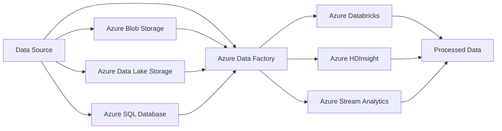

# Data Processing in Azure ⚙️

Welcome to the Data Processing section of the Azure Data Fundamentals Guide! 🌟 In this section, we will explore the various data processing capabilities and services available in Azure.

## Introduction to Data Processing

Data processing involves transforming and manipulating raw data into meaningful insights. Azure provides a rich set of services and tools to help you process and analyze data efficiently, enabling you to derive valuable insights and make informed decisions.

## Key Data Processing Services in Azure

Here are some of the key data processing services available in Azure:

🔄 **Azure Databricks**: A collaborative Apache Spark-based analytics service that provides a unified workspace for big data processing and machine learning.

🧮 **Azure HDInsight**: A fully managed cloud service that makes it easy to process big data workloads using popular open-source frameworks, such as Hadoop, Spark, Hive, and more.

⚡ **Azure Stream Analytics**: A real-time analytics service that can ingest, analyze, and process streaming data from various sources, allowing you to gain insights in near real-time.

🌐 **Azure Data Factory**: A fully managed, serverless data integration service that enables you to orchestrate and automate data movement and transformation across various sources and destinations.

## Azure Data Processing Workflow

Understanding the workflow of data processing in Azure can help you design efficient and scalable data pipelines. The following Mermaid diagram depicts the typical data processing flow:

---
📝 Next Steps

> Congratulations! You now have an overview of the key data processing services in Azure. 🎉 To learn more about each data processing service in detail and explore their features, use cases, and best practices, continue to the specific sections dedicated to each service in this guide.

To understand data visualization and reporting in Azure, proceed to the Data Visualization section in the Key Concepts directory.
