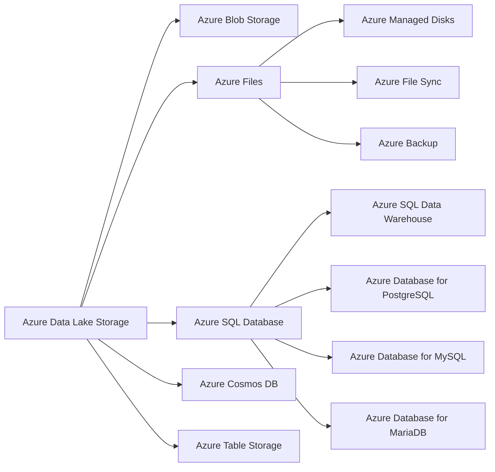

# Data Storage in Azure 🗄️

Welcome to the Data Storage section of the Azure Data Fundamentals Guide! 🌟 In this section, we will explore the various data storage options available in Azure and their key features.

## Introduction to Data Storage in Azure

Data storage is a fundamental component of any data management and analytics solution. Azure offers a wide range of storage services to meet diverse data storage requirements, whether it's for structured, semi-structured, or unstructured data.

## Key Data Storage Options in Azure

Here are some of the key data storage options available in Azure:

🌊 **Azure Data Lake Storage**: Scalable and secure storage for big data analytics workloads, supporting both structured and unstructured data.

💾 **Azure Blob Storage**: Object storage service for storing large amounts of unstructured data, such as documents, images, and media files.

🗄️ **Azure Files**: Fully managed file shares in the cloud, providing file storage for applications and virtual machines.

🔒 **Azure Managed Disks**: Persistent storage for virtual machines, simplifying disk management and providing high durability.

📊 **Azure SQL Database**: Fully managed relational database service for building and managing cloud-based applications.

## Azure Data Storage Hierarchy and Relationships

Understanding the hierarchy and relationships between Azure data storage services can help you make informed decisions about selecting the appropriate storage options for your data workloads.

---

📝 Next Steps

> Congratulations! You now have an overview of the key data storage options in Azure. 🎉 To learn more about each storage option in detail and explore their features and use cases, continue to the specific sections dedicated to each storage option in this guide
