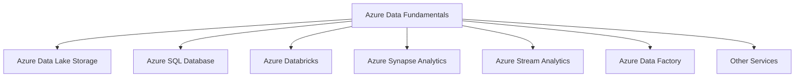

# Introduction to Azure Data Fundamentals 🌟

Welcome to the Azure Data Fundamentals Guide! 🚀 This guide is designed to provide you with a comprehensive understanding of Azure Data Fundamentals and its significance in the world of data management and analytics. 

## What is Azure Data Fundamentals?

Azure Data Fundamentals is a foundational-level certification and learning path offered by Microsoft Azure. It focuses on essential concepts and services related to data storage, data processing, data integration, and data security in the Azure cloud environment.

## Why Azure Data Fundamentals?

🔑 **Key Benefits**:
- Gain a solid understanding of data management and analytics fundamentals in Azure.
- Explore various Azure services for storing, processing, and analyzing data.
- Build the foundational knowledge required for advanced Azure data certifications.

## What Will You Learn?

In this guide, you'll learn about:

- Different data storage options in Azure, including Azure Data Lake Storage and Azure SQL Database.
- Techniques for data ingestion and processing using Azure services such as Azure Databricks, Azure Synapse Analytics, and Azure Stream Analytics.
- Data integration approaches with Azure Data Factory and other relevant services.
- Best practices for ensuring data governance and security in Azure.

## Who Should Use This Guide?

This guide is ideal for:

- Data professionals who want to enhance their knowledge and skills in Azure data management and analytics.
- IT professionals and developers interested in understanding the foundational aspects of data in the Azure ecosystem.

---

🌍 **Explore the Azure Data Fundamentals Landscape**

---

📝 **Next Steps**

Now that you have an overview of Azure Data Fundamentals, let's dive into the guide and get started with the essentials. 🚀

Read the [Getting Started](./Getting-Started/README.md) section to set up your Azure account and access the Azure portal. Then, explore the subsequent sections to build your understanding of key concepts, features, best practices, and more.

---

🔗 **Additional Resources**

Check out the [Community and Resources](./Community-and-Resources/README.md) section for links to forums, documentation, tutorials, and other valuable resources to support your learning journey.

📝 **License**

This repository is licensed under the [MIT License](../LICENSE).
